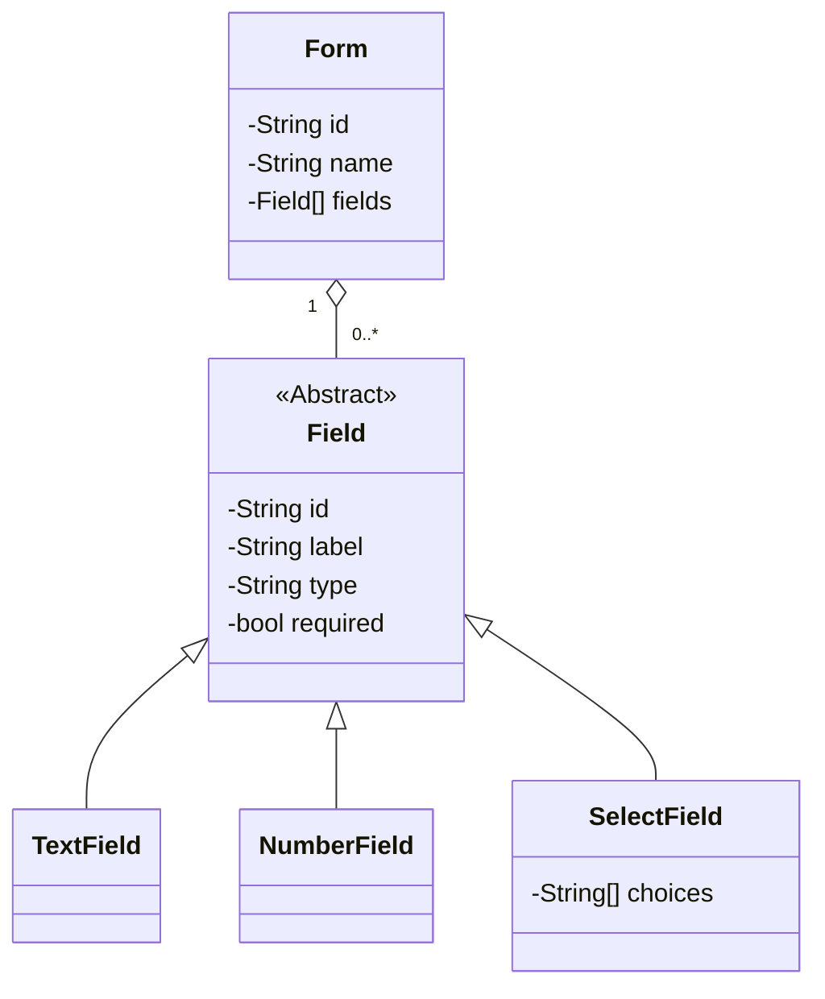

# Desafio Técnico para Desenvolvedor(a) PHP Full Stack

Bem-vindo ao nosso desafio técnico! Estamos ansiosos para conhecer mais suas habilidades em desenvolvimento backend.

## Objetivo do Desafio

Desenvolver uma API com dois endpoints para lidar com o preenchimento de formulários dinâmicos, uma para salvar preenchimentos de formulários, e outra para recuperar os preenchimentos salvos de um formulário específico.

Imagine um Google Forms, mas melhor, afinal, você vai implementar! 

## Sobre os formulários

Por se tratar de um sistema de coleta de dados, é necessário que os formulários sejam dinâmicos, ou seja, que possam ser criados e alterados sem a necessidade de alterar o código da aplicação. Para o desafio, suportaremos três tipos de campos: texto, numéricos e de seleção.

A definição dos formulários suportados encontra-se no arquivo `forms_definition.json`. Este arquivo contém uma lista de objetos, onde cada objeto representa um formulário. Lembre-se, para este desafio, a definição dos formulários deve ser lida a partir deste arquivo, e não de um banco de dados.

Cada formulário possui os seguintes atributos:
- `id`: identificador único do formulário.
- `name`: nome do formulário.
- `fields`: lista de campos do formulário.

A lista de campos de um formulário é um array de objetos, onde cada objeto representa um campo do formulário. 

Cada campo possui os seguintes atributos:
- `id`: identificador único do campo.
- `label`: rótulo do campo.
- `type`: tipo do campo (`text`, `number` ou `select`).
- `required`: indica se o campo é obrigatório.

O campo `select` possui um atributo adicional:
- `choices`: lista de opções disponíveis para seleção.

Diagrama de Classes ([versão SVG](./docs/diagram.svg)):

## Especificação da API

### Endpoints

**POST /preenchimentos/{id_formulario}/preenchimentos**:
 - Salvar um novo preenchimento de formulário.
 - Observe o identificador do formulário no caminho da URL (`id_formulario`) para determinar o formulário ao qual o preenchimento pertence.
 - A validação dos campos deve ser realizada conforme as regras especificadas na estrutura do formulário.
 - Retorne um erro 400 com uma mensagem de erro apropriada se o preenchimento não atender às regras de validação.
 - Retorne um erro 404 se o `id_formulario` não existir.
 - Retorne resposta 201 com o preenchimento salvo se o preenchimento for bem-sucedido.

**GET /preenchimentos/{id_formulario}/preenchimentos**:
 - Recuperar todos os preenchimentos de um formulário específico.
 - Observe o identificador do formulário no caminho da URL (`id_formulario`) para determinar o formulário ao qual os preenchimentos pertencem.
 - Retorne um erro 404 se o `id_formulario` não existir.
 - Retorne resposta 200 com uma lista de preenchimentos do formulário especificado.

Você pode encontrar mais detalhes sobre os endpoints no arquivo [docs/api_spec.yaml](./docs/api_spec.yaml).

### Regras de validação

De acordo com o tipo do campo e a propriedade `required`, as seguintes regras de validação devem ser aplicadas:
 - Quando um campo é `required`, ele deve ser preenchido, ou seja, não pode ser nulo ou vazio.
 - O campo `text` deve ser uma string.
 - O campo `number` deve ser um número (inteiro ou decimal, positivo ou negativo).
 - O campo `select` deve ser uma string e deve ser uma das opções disponíveis no campo (verifique o atributo `choices`).

## Instruções adicionais

 - Você deve implementar a API de acordo com a especificação fornecida.
 - Envie o código-fonte do projeto em um repositório Git (GitHub, GitLab, Bitbucket, etc.).
 - Não esqueça de incluir um README com informações sobre como configurar e rodar o projeto, especialmente se utilizar Docker.
 - A escolha de linguagem e framework é livre, porém, ao se tratar de um desafio para uma vaga de PHP, é recomendado que você utilize PHP para a implementação da API. Fique à vontade para usar qualquer stack que julgar mais adequada para o desafio.
 - Fique à vontade para demonstrar suas habilidades e tomar decisões técnicas que você considere apropriadas para resolver o desafio da melhor maneira possível.
 - Estamos buscando código limpo e bem estruturado, com boas práticas de desenvolvimento.
- Testes automatizados (unitários ou funcionais) serão altamente apreciados.
- Docker é uma ótima ferramenta para garantir que o projeto seja facilmente executado em diferentes ambientes.

E, por último, mas não menos importante:
- Caso você seja aprovado, você será compensado com o equivalente a **5 horas de desenvolvimento** pelo tempo dedicado à confecção do desafio.

Esperamos que você se divirta com o desafio e estamos ansiosos para ver o que você consegue construir!

Boa sorte e, caso tenha dúvidas, estamos à disposição para ajudar!